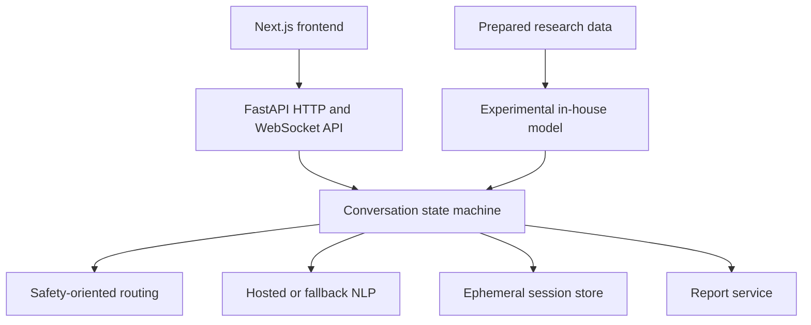

# Mental Health Conversational Triage Platform

A full-stack research prototype for structured conversational triage. The project combines a FastAPI backend, Next.js interface, staged conversation flow, configurable LLM integration, report generation, and an experimental in-house NLP model.

> **Scope:** this is a research and software-engineering prototype. It is not a diagnostic tool, medical device, therapist, or replacement for qualified professional support.

## Highlights

- Narrative-first conversation flow followed by structured questions
- Multi-turn state management and safety-oriented routing
- Configurable hosted-model integration with offline fallback behavior
- Session reports and next-step summaries
- Experimental PyTorch model and retraining scripts
- Next.js frontend with real-time session communication
- Backend tests and GitHub Actions CI

## Architecture



## Repository Layout

```text
Mental_health/
├── backend/
│   ├── app/
│   ├── tests/
│   └── requirements.txt
├── frontend/
├── inhouse_model/
├── scripts/
├── data/
├── docs/
└── docker-compose.yml
```

## Local Development

### Backend

```bash
git clone https://github.com/Leadyhere/Mental_health.git
cd Mental_health
python -m venv .venv
source .venv/bin/activate
pip install -r backend/requirements.txt
uvicorn backend.app.main:app --reload
```

Copy `.env.example` to `.env` and replace development secrets before any shared deployment.

### Frontend

```bash
cd frontend
npm ci
npm run dev
```

## Tests and Builds

```bash
pytest backend/tests/
cd frontend && npm run build
```

## Data, Privacy, and Safety

- Confirm the provenance, permission, and de-identification of every dataset before publication or training.
- Do not store private conversations in source control.
- Use short retention periods and authenticated deletion/export controls in deployments.
- Treat model outputs as uncertain signals that require rigorous evaluation.
- Have safety messaging and regional resources reviewed by qualified domain experts.
- The quick-lock interface is a convenience screen, not encryption or a substitute for authentication.

## Known Limitations

- Research rules and model outputs have not been clinically validated.
- Development defaults use local or in-memory services.
- Authentication, authorization, encryption claims, audit logging, and deployment hardening require further work.
- The experimental model needs documented benchmarks, calibration, fairness testing, and versioned artifacts.

## Roadmap

- Add a threat model and privacy policy
- Add end-to-end tests and measurable safety evaluation
- Replace convenience PIN behavior with verified authentication
- Document dataset provenance and model cards
- Add production storage, migrations, monitoring, and rate limits

## License

No license has been selected yet.
